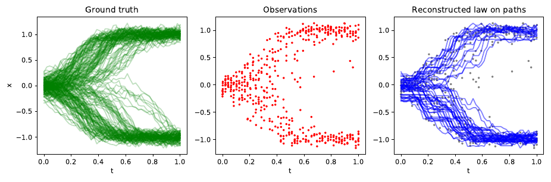

# gWOT: Global Waddington-OT

  

Principled trajectory inference for time-series data with limited samples by optimal transport.

## Introduction

Global Waddington-OT (gWOT) is a trajectory inference method for time-series data based on optimal transport (OT).
Given a time-series of snapshot data, gWOT aims to estimate trajectory information in the form of a _probability distribution_ over possible trajectories taken by cells.

As an example, we illustrate below a ground truth process where cell trajectories are known exactly (green). From this, independent snapshots are sampled at various temporal instants, each with limited sample resolution (red). From these data, gWOT aims to reconstruct trajectories as a law on paths (blue).

The underlying model assumption on which gWOT is based is that the generative process is a drift-diffusion process with branching, in which the evolution of any cell over an infinitesimal time is described by the stochastic differential equation (SDE) 

.

Cells in this process also divide and die at rates `beta(x, t)` and `delta(x, t)` respectively. Consider the setting where independent snapshots are sampled at many timepoints, but each individual snapshot may only contain partial information due to capturing only a few particles.

From this data (red) **gWOT** aims to estimate the underlying stochastic process in the form of a *law on paths* (blue).

## Installation

To install, use `pip install gwot`.

Alternatively, clone this repository and `cd gWOT && pip install .`

## Documentation

Read the [documentation](https://gwot.readthedocs.io/en/latest/) and also refer to the [paper](https://arxiv.org/abs/2102.09204) for mathematical details regarding the method and its implementation.

## Example application 1: bistable landscape with branching

This is a simple example tutorial covering basic application of gWOT to simulated data from a bistable (bifurcating) stochastic process where particles undergo branching (division). 

## Example application 2: reprogramming dataset (Schiebinger et al., 2019) 

## Paper

This code accompanies the paper [(arXiv link)](https://arxiv.org/abs/2102.09204)

Lavenant, H., Zhang, S., Kim, Y., & Schiebinger, G. (2021). Towards a mathematical theory of trajectory inference.
